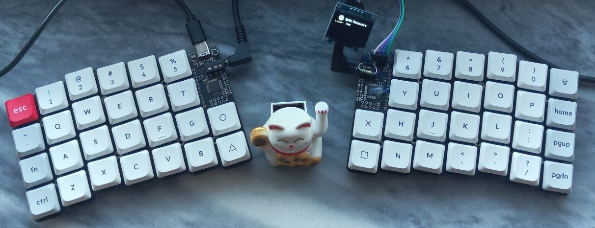

# Orbiter Keyboard

A 52-key split keyboard.

 

!!DISCLAIMER!! There are issues with v1.00 that needs manual patching:
- BOOT0 logic is reversed which makes device always go into DFU mode, R6 needs to be connected to GND
- USB-C CC pin pull-up is common, which makes the USB cable one-way, CC1 and CC2 each needs a 5.1k pull-down resistor
